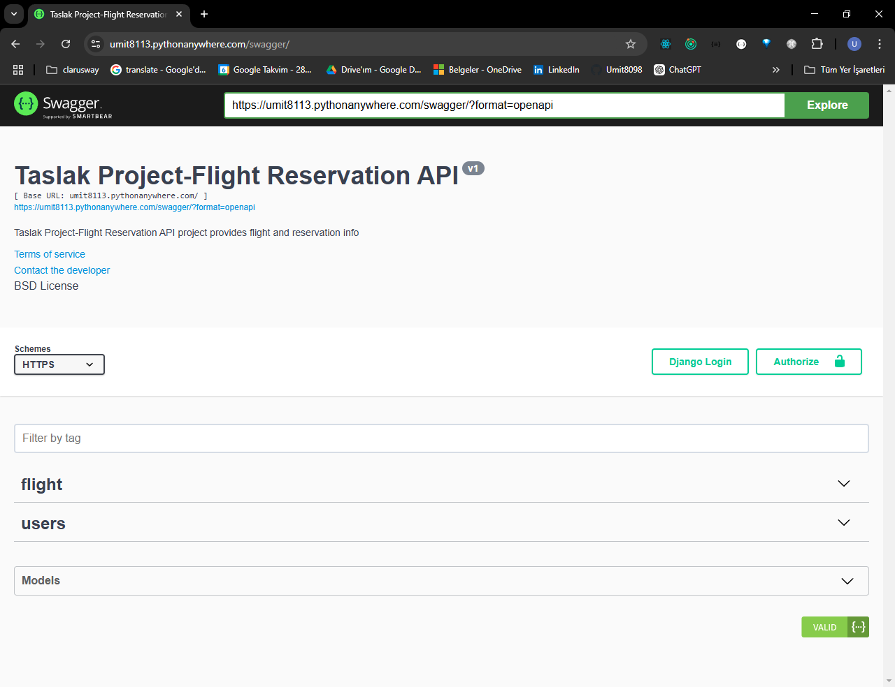
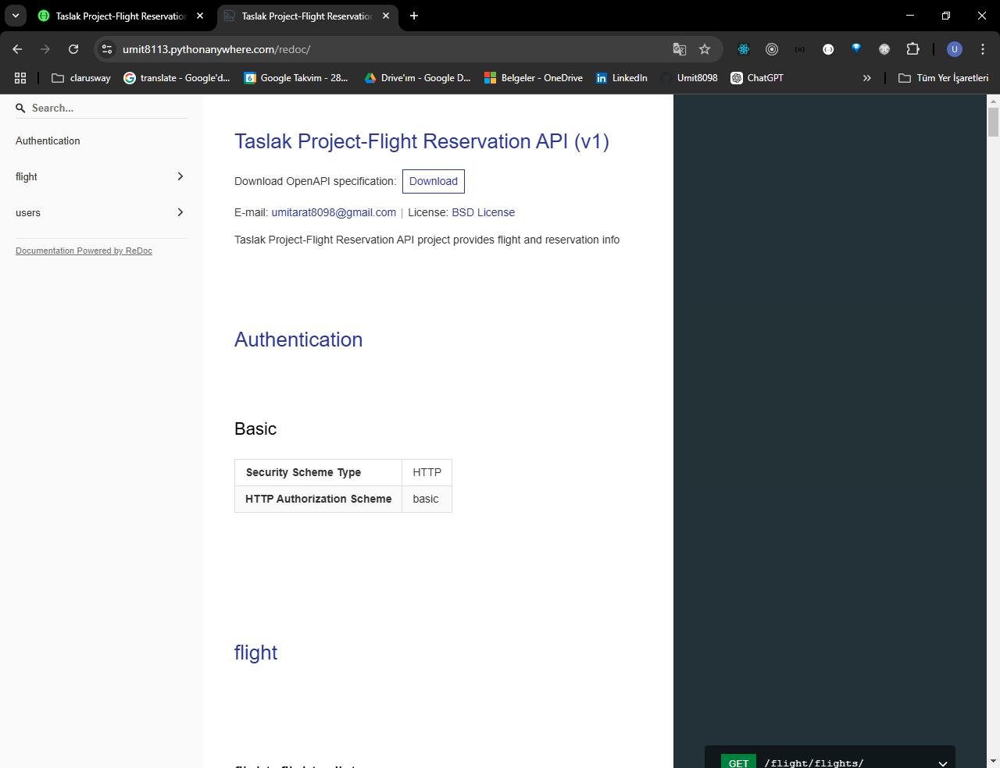
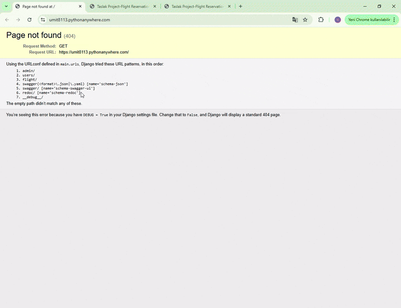
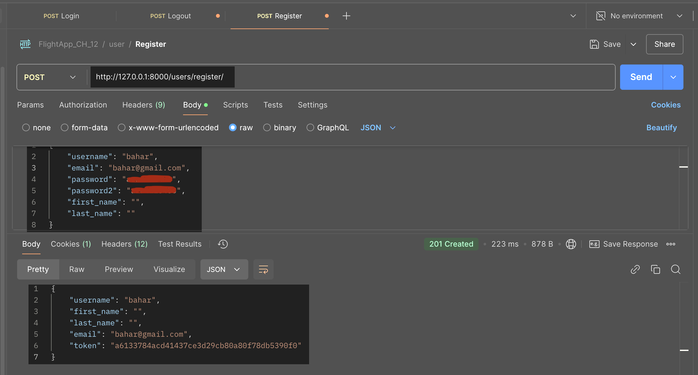
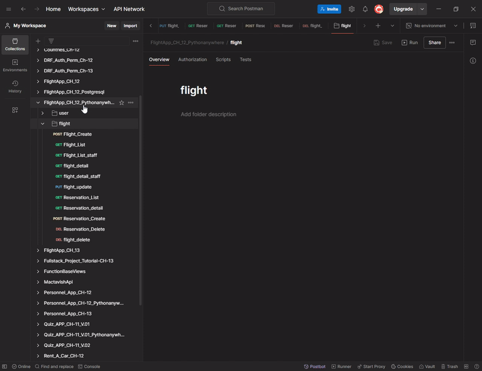
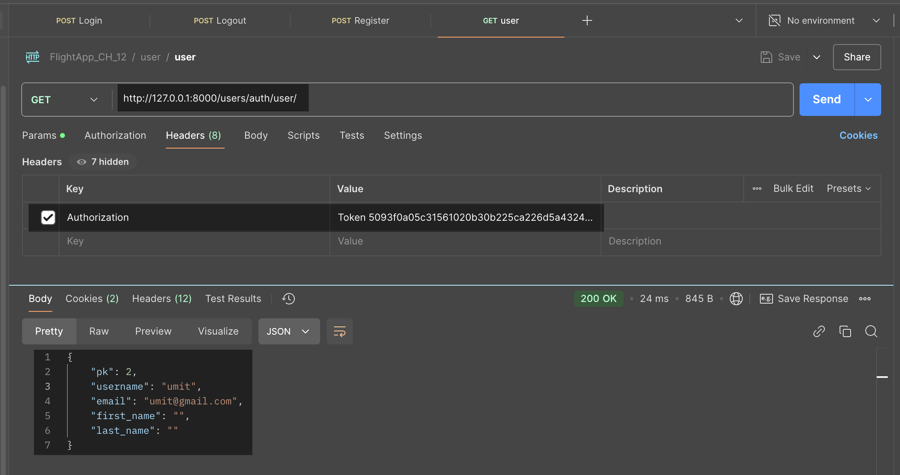
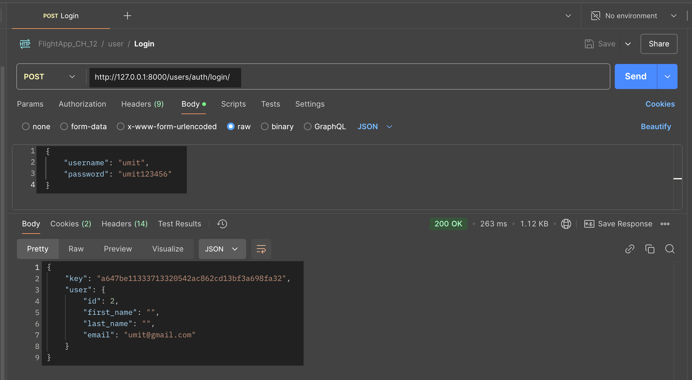
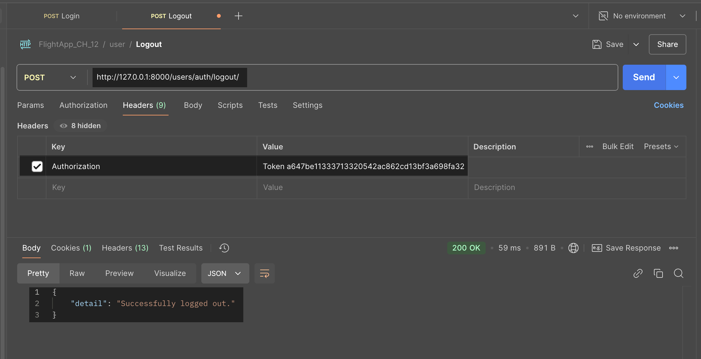
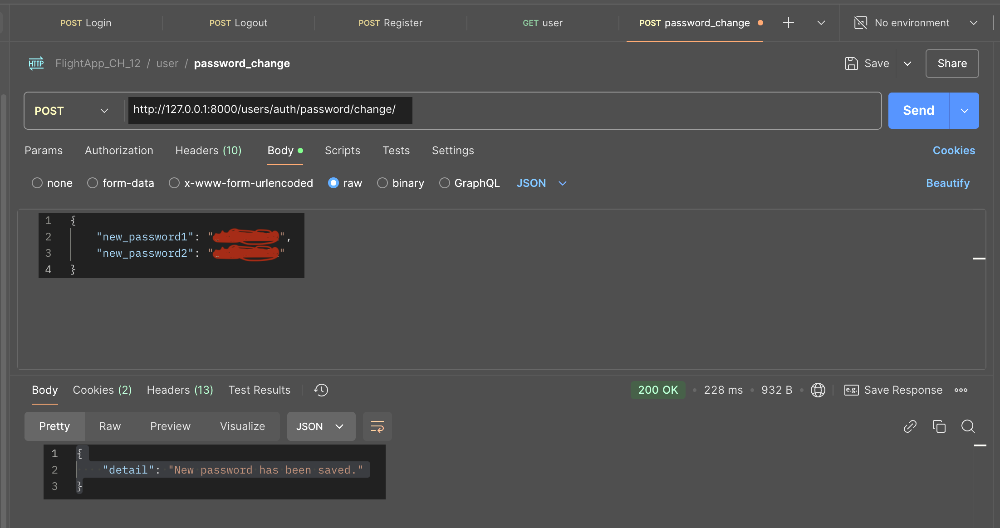

<p align="center">
  
  
  
  
  
  
  
  
</p>

<h1 align="center">✈️ Flight Reservation API</h1>

<p align="center">
Flight Reservation API is a robust backend solution designed to handle complex flight booking workflows. From schedule management for staff to seamless reservation flows for users, this project demonstrates a modern approach to API development with a focus on scalability, security (JWT/Token Auth), and cloud-native deployment.
</p>

<div align="center">
  <h3>
    <a href="https://flight-reservation-api-production.up.railway.app/swagger/">
      🖥️ Live Demo
    </a>
     | 
    <a href="https://github.com/umitarat-dev/flight-reservation-api.git">
      📂 Repository
    </a>
  </h3>
</div>

<p align="center">
  <a href="https://flight-reservation-api-production.up.railway.app/swagger/">
    
  </a>
</p>


## 📚Navigation
- [🚀 API Documentation](#-api-documentation)
- [🚀 API Testing](#-api-testing)
- [✨ Overview](#-overview)
- [🛠️ Built With](#-built-with)
- [⚡ How To Use](#-how-to-use)
- [🌍 About This Project](#-about-this-project)
- [⚡ Key Features](#-key-features)
- [📬 Contact Information](#-contact-information)


## 🚀 API Documentation

You can access the detailed API documentation of the project from the links below:

- [Swagger Documentation](https://umit8113.pythonanywhere.com/swagger/)
<!--  -->

➡ Interface that allows you to easily test API endpoints.

---

- [Redoc Documentation](https://umit8113.pythonanywhere.com/redoc/)
<!--  -->

➡ Documentation tool that presents the API structure in a detailed and organized way.

---

<!-- - Bu dokümantasyonlar sayesinde API endpoint'lerini kolayca test edebilir ve yapılarını inceleyebilirsiniz. -->
**Notes:** You can access Swagger and Redoc documentation without any user login.

**Not:** Swagger ve Redoc dokümantasyonlarına herhangi bir kullanıcı girişi yapmadan erişebilirsiniz.

- Along with Swagger and Redoc documentation, you can use our Postman collection to test APIs.
 [Flight Reservation API Postman Collection](https://umit-dev.postman.co/workspace/Team-Workspace~7e9925db-bf34-4ab9-802e-6deb333b7a46/collection/17531143-5c497d31-9dd6-44f2-930c-8f4337595920?action=share&creator=17531143)

## 🚀 API Testing

To test APIs via Postman, you can follow the steps below:
1. Install Postman (if not installed): [Download Postman](https://www.postman.com/downloads/).
2. This [Postman Collection](https://umit-dev.postman.co/workspace/Team-Workspace~7e9925db-bf34-4ab9-802e-6deb333b7a46/collection/17531143-5c497d31-9dd6-44f2-930c-8f4337595920?action=share&creator=17531143) Download and import.
3. Start testing APIs via Postman.

**Postman Collection Link:**  
[Flight Reservation API Postman Collection](https://umit-dev.postman.co/workspace/Team-Workspace~7e9925db-bf34-4ab9-802e-6deb333b7a46/collection/17531143-5c497d31-9dd6-44f2-930c-8f4337595920?action=share&creator=17531143)


## ✨ Overview

Flight Reservation App is a modern API solution through which users can manage flight reservations. Main features:
- **Flight Management:** staff users can add, update and delete flights.
- **Reservation Management:** staff users can view all reservations, users can manage their own reservations.
- **Anonymous Access:** Unregistered users can only view future flights.
- **Advanced User Authorization:** Users have the ability to change passwords and manage their own booking processes.
- **API Documentation with Swagger and Redoc:** Ability to examine and test the API structure in detail.
- **PostgreSQL Support:** Powerful and reliable database support in the Production environment.

---

- Project Swagger and Redoc Documentation Visual 
<!--  -->

➡ Interface that allows you to easily test API endpoints.

---

- user/authentication app testing on Postman
<!--  -->

➡ User registration process screen.

---
- Flight app testing on Postman
<!--  -->

➡ Flight booking test with Postman.

---
- user/authentication app testing on Postman
<!--  -->


---
- user/authentication app testing on Postman
<!--  -->


---
- user/authentication app testing on Postman
<!--  -->


---
- user/authentication app testing on Postman
<!--  -->


---

<!-- - API dokümantasyonları Swagger ve Redoc ile detaylandırılmıştır. İlgili linklere <a href="https://umit8113.pythonanywhere.com/swagger/" target="_blank">Swagger</a> ve <a href="https://umit8113.pythonanywhere.com/redoc/" target="_blank">Redoc</a> üzerinden ulaşabilirsiniz. -->

- API documentation is detailed with Swagger and Redoc. You can access the relevant links via [Swagger](https://umit8113.pythonanywhere.com/swagger/) and [Redoc](https://umit8113.pythonanywhere.com/redoc/).


- Flight Reservation App is a modern backend application developed to enable users to manage flight reservations and provide easy integration with API documentation.
- Provides CRUD operations specific to users and staff roles.
- Swagger and Redoc were used for API documentation.


## 🛠️ Built With

<!-- This section should list any major frameworks that you built your project using. Here are a few examples.-->

- [Django Rest Framework](https://www.django-rest-framework.org/) - A powerful framework for developing REST APIs.
- [Swagger And Redoc](https://drf-yasg.readthedocs.io/en/stable/readme.html#installation) - API documentation and testing tools. 
- [Debug_Toolbar](https://django-debug-toolbar.readthedocs.io/en/latest/installation.html) - A powerful tool for debugging operations.
- [Logging](https://docs.djangoproject.com/en/5.1/topics/logging/) - System logging modul
- [dj-rest-auth](https://dj-rest-auth.readthedocs.io/en/latest/) - User authentication and authorization.
- PostgreSQL - High performance database for production environment.


## ⚡ How To Use

<!-- This is an example, please update according to your application -->

- For online demo: You can take a look at the [Swagger](https://umit8113.pythonanywhere.com/swagger/) and [Redoc](https://umit8113.pythonanywhere.com/redoc/) interfaces.

- To clone and run this application, you'll need [Git](https://github.com/Umit8098/Project_Django_Rest_Framework_Flight_App_CH-12.git) 

- When installing the required packages in the requirements.txt file, review the package differences for windows/macOS/Linux environments. 

- Complete the installation by uncommenting the appropriate package.

---

```bash
# Clone this repository
$ git clone https://github.com/umitarat-dev/flight-reservation-api.git

# Install dependencies
    $ python -m venv env
    $ python3.9 -m venv env (for macOs/linux OS)
    $ env/Scripts/activate (for win OS)
    $ source env/bin/activate (for macOs/linux OS)
    $ pip install -r requirements.txt
    $ python manage.py migrate (for win OS)
    $ python3 manage.py migrate (for macOs/linux OS)

# Create and Edit .env
# Add Your SECRET_KEY in .env file

"""
# example .env;

SECRET_KEY =123456789abcdefg...

# for development(dev) environments
DEBUG =True

# PostgreSQL settings for product (product) environments
SQL_DATABASE={your_database_name}
SQL_USER={your_database_user}
SQL_PASSWORD={your_database_password}
SQL_HOST=localhost
SQL_PORT=5432

# for choices environment
ENV_NAME =dev
# ENV_NAME =prod

# Logging level
DJANGO_LOG_LEVEL=INFO
"""

# Run the app
    $ python manage.py migrate
    $ python manage.py runserver
```


## 🌍 About This Project

This project was developed to modernize flight booking processes and make flight planning easier for users. It aims to provide solutions for the following situations:

- **User Needs:** Users can manage their own reservations by registering.
- **Business Requirements:** staff users to manage flights and reservations more efficiently.
- **Easy Integration:** Easy connection with third-party systems thanks to API documentation.


The following technical approaches and solutions were applied in this project:

- **Development Environment:** Separate settings for Development and Production environments.
- **Performance Optimization:** Big data management using PostgreSQL.
- **API Documentation:** Comprehensive API documentation with Swagger and Redoc.
- **User Authorization:** Authorization structure suitable for staff and normal user roles.

---

Bu proje, uçuş rezervasyon süreçlerini modernleştirmek ve kullanıcıların uçuş planlamasını kolaylaştırmak amacıyla geliştirilmiştir. Aşağıdaki durumlar için çözüm sunmayı hedefler:

- **Kullanıcı İhtiyaçları:** Kullanıcıların kayıt olarak kendi rezervasyonlarını yönetebilmesi.
- **İşletme Gereksinimleri:** staff kullanıcıların uçuşları ve rezervasyonları daha verimli yönetmesi.
- **Kolay Entegrasyon:** API dokümantasyonu sayesinde üçüncü parti sistemlerle kolay bağlantı kurulması.


Bu projede aşağıdaki teknik yaklaşımlar ve çözümler uygulanmıştır:

- **Geliştirme Ortamı:** Development ve Production ortamları için ayrı ayarlar.
- **Performans Optimizasyonu:** PostgreSQL kullanımı ile büyük veri yönetimi.
- **API Dokümantasyonu:** Swagger ve Redoc ile kapsamlı API dokümantasyonu.
- **Kullanıcı Yetkilendirme:** staff ve normal kullanıcı rollerine uygun yetkilendirme yapısı.


## ⚡ Key Features


- **Flight Reservation Management:** Users can view and book flights.
- **Staff Authorizations:** Staff users can fully control flights and reservations.
- **API Documentation:** Detailed API documentation with Swagger and Redoc.
- **User Authorization:** Registration, login, password change and reservation management.
- **PostgreSQL Support:** High performance database in production environment.

---

- **Uçuş Rezervasyon Yönetimi:** Kullanıcılar uçuşları görüntüleyebilir ve rezervasyon yapabilir.
- **Staff Yetkileri:** Staff kullanıcılar uçuş ve rezervasyonları tam kontrol edebilir.
- **API Dokümantasyonu:** Swagger ve Redoc ile detaylı API dokümantasyonu.
- **Kullanıcı Yetkilendirme:** Kayıt, giriş, şifre değiştirme ve rezervasyon yönetimi.
- **PostgreSQL Desteği:** Production ortamında yüksek performanslı veritabanı.


## 📬 Contact Information

I am always open to discussing new projects, creative ideas, or opportunities to be part of your visions.

* **LinkedIn:** [linkedin.com/in/umit-arat](https://www.linkedin.com/in/umit-arat/)
* **Email:** [umitarat8098@gmail.com](mailto:umitarat8098@gmail.com)
* **GitHub:** [github.com/umitarat-dev](https://github.com/umitarat-dev) (Current Workspace)